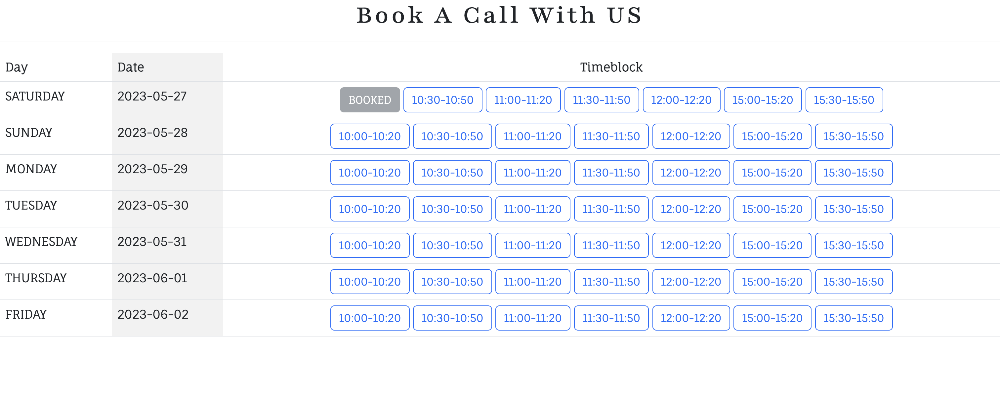
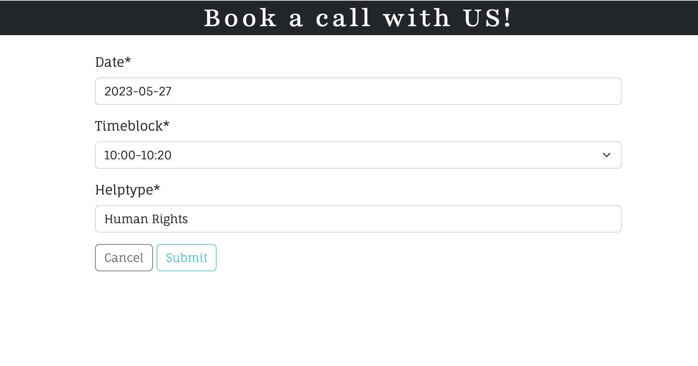
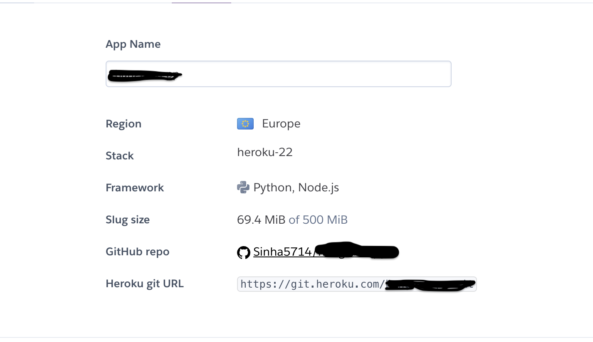

# Humanitas

[Link to the website]()


## Table of Contents

0. [About](#about)
1. [Project Goals](#project-goals)
   1. [User Goals](#user-goals)
2. [User Experience](#user-experience)

   1. [Target Audience](#target-audience)
   2. [User Requirements and Expectations](#user-requirements-and-expectations)
   3. [User Stories](#user-stories)
   4. [Site Owner Stories](#site-owner-stories)

3. [Design](#design)

   1. [Colors](#colours)
   2. [Fonts](#fonts)

4. [Project Structure](#project-structure)

   1. [Web Pages](#web-pages)
   2. [Sections](#sections)
   3. [Code Structure](#code-structure)

5. [Agile Design](#agile-design)

6. [Database](#database)

   1. [Data Models](#data-models)

7. [Features](#features)
   1. [Implemented Features](#implemented-features)
   2. [Features To Be Implemented](#features-to-be-implemented)
8. [Validation](#validation)
   1. [CSS](#css)
   2. [HTML](#html)
   3. [Python](#python)

# About

- Humanitas is a helping organisation which connects people who needs help to people who can provide help.
- The website is build so that user can book a call with the team and find the right help.
- It also consists of stories written by various people who were helped around the world.

---

## Project Goals

Primary goals of the project (web app):

- Give users  an online platform to connect with a helping organisation
- Enable users to express themselves through a written form i.e. Comment or Stories
- Enable users to book a call and share their problems with the team

### User Goals

- Ability to share their stories
- Be able give an opinion on a topic
- Ability to amend and update content
- Chance to connect with a variety of interesting individuals.
- Able to book an appointment with the team
- Able to change and cancel the appointments

## User Experience

### Target Audience

- People around the world who need help
- Individuals who want to share their stories to the world

### User Requirements and Expectations

- Application with a clear purpose
- An user-friendly interface that allows quick and efficient navigation
- Responsive and visually good design
- Engaging content within the limits of set categories
- Ways to engage with a team or a developer

### User stories

1. As a Site User I want the navigation to be user-friendly so that I'm able to easily navigate through the app content.
2. As a Site User I want to know info on what the app is about so that I can use its functionality for mutual benefit
3. As a Site User I can be able to register, login and logout from the website so that I can have a safe environment to work with
4. As a Site User I can be able to send message so that I can communicate with the website owner
5. As a Site User I can view the stories page so that I can view the stories
6. As a Site User I can click a story so that I can read the full post
7. As a Site User I can comment on the story so that I can be involved in conversation
8. As a Site User I can delete comments so that I can delete unwanted comments in my story and also my comments in other's stories
9. As a Site User I can add a story so that I can share my thoughts with different people
10. As a Site User I can edit my story so that I can change the content when I want
11. As a Site User I can be able delete my story so that I can delete my blog when needed
12. As a Site User I can be able to add my profile to the website so that I can interact comfortably
13. As a Site User I can be able to edit and update my profile so that I can change details whenever I want
14. As a Site User I can be able to delete my profile so that I can be sure my data is save when I don't want to use website anymore
15. As a Site User I can book an appointment so that I can communicate with the site owner
16. As a Site User I can view my bookings so that I can easily check for my bookings
17. As a Site User I can edit my appointment so that I can get flexibility in booking
18. As a Site User I can delete my appointment so that I can have decide if I want to cancel the appointment

### Site Owner Stories

19. As a Site Owner I want to restrict access to sections of an app to unauthenticated users so that basic standards of data protection are met
20. As a Site Owner I would like that authenticated users have full access to web app and its functionality
21. As a Site Owner I would like that each data entry is validated before stored in database
22. As a Site Owner I would like that users can leave a message via contact form
23. As a Site Owner I would like that each authenticated user gets prompt messages when performing CRUD(Create,Read,Update,Delete) operations when using web app.
24. As a Site Owner I would like that user can not book an appointment which is already booked

## Design

---

### Colours

Web app is utilizing bootstrap inbuilt dark background and other colors were selected by site owner. It's a self custom design as per wish of Site Owner.

### Fonts

Google fonts "'Playfair', sans-serif" modern and "'Fauna One', sans-serif" font were used for this project as it offers clean and legible design, which makes it easy to read on screens of different sizes and resolutions. It has a neutral appearance and doesn't have any distracting features that can make it difficult to read.

<details><summary>See Playfair</summary>

</details>

<details><summary>See Fauna One</summary>

</details>

## Project Structure

### Web Pages

The web pages are easy to navigate and consists of various pictures and backgrounds for better visual of the website.

### Sections

##### Home page

- A navbar with nav-items to navigate to various pages in the website
- Hero Section consist of carousel which support three images and a Hero-content within it
- Our Mission section explains about the mission of the Humanitas company
- Our Vision section explains about the vision Humanitas company wants to acheive
- Footer with social media and useful navigation links

##### About Page

- A navbar with nav-items to navigate to various pages in the website
- A section about what we doo with a responsive image background
- A section with story of the site owner
- Footer with social media and useful navigation links

##### Our Stories Page

- A navbar with nav-items to navigate to various pages in the website
- A card display of stories written by users
- Footer with social media and useful navigation links

##### Contact Page

- A navbar with nav-items to navigate to various pages in the website
- A contact form to communicate with the website owner and team
- An image for better view

##### Booking Page

- A navbar with nav-items to navigate to various pages in the website
- A table consisting of day,date and timeblocks for booking an appointment
- Footer with social media and useful navigation links

##### Profile Page

- A navbar with nav-items to navigate to various pages in the website
- Page to display data of the user

##### My Bookings Page

- A navbar with nav-items to navigate to various pages in the website
- Table consisting data of bookings of user

##### My Stories Page

- A navbar with nav-items to navigate to various pages in the website
- A card display of stories written by the user
- Footer with social media and useful navigation links

### Code structure

Project code structure is organized and divided into various application folders and constructed using Django Framework

#### Project Apps

- Home app - constructed to deliver basic information for the User about the app via Home page with simple an intuitive navigation(links in nav-bar and footer to navigate throughout the app).

  It also provides the following functionalities:

  1. basic contact form for user to contact the team and a footer
  2. user authentication and profile management functionality, full CRUD functionality, so user can create an account, update profile, upload supporting images for a profile

- stories app - constructed to deliver CRUD functions of a humanitas stories app, where  the structure includes the necessary files for running the application, including the views, models, and templates required to create, read, update, and delete blog posts and comments.

- booking app - delivers functionality for users to book a call with the team and site owner . The app includes views and templates for displaying the bookings of user and also to create, update and delete existing bookings.

#### Other django apps

- **settings.py**: This file contains configuration settings for your Django project, such as database settings, installed apps, and middleware.
- **Procfile**: This file is used to specify the commands that should be executed when your Django app is deployed on a hosting platform.
- **static**: This directory contains the base CSS and JavaScript files
- **templates**- base-level folder with basic templates extended throughout other templates like: base.html, navbar.html, footer.html, also templates for user authentication. and also each app has its own templates folder with HTML files to support the app's functionality and reusability
- **requirements.txt**: This file lists the dependencies required for the Django project to run.
- **env.py**: This file is used to store environment variables for a Django project or application, such as database connection details or API keys.

##### Back to [top](#table-of-contents)

## Agile design

### About

- Agile development is the most effective way to development of any website
- It was my first attempt and I found it very challenging but somehow was able to do basic development in agile environment
- I forgot to set milestones in first instance and started the project without it. Hopefully in upcoming projects, I can be able to do it better.
- I have followed the "Think Before I Blog" project by Code Institute and just did it wth User story template.
- I was able to provide labels to user stories but in later stage of project
- I am aware that planning can be better and clear and will be implementing the agile development better from next project.

### User Story Template

- Using Github issues first I created the template for a user story that was later used to create user stories. It can be improved further for this project I used just a basic template. I created four labels: must-have, could have, should have and good to have.

<details><summary>See User story template</summary>

</details>

### Kanban Board

- As a visual representation of the project's status, showing what tasks are to be done, in progress and completed.Each task is represented as a card on the board, and the cards can be moved from one column to another to show progress. Kanban board is an excelent tool and since it was my first time using I didnt get the full benefits of using it ,since it wasnt used as often as it should, but since completing the project I am more aware of its great purpose and I am sure it will be utilized more and more in the future

[Link to project Kanban board.](https://github.com/users/Sinha5714/projects/5)

<details><summary>See Kanban board</summary>

</details>

### Moscow Prioritisation

- The Moscow prioritization technique is used to prioritize project requirements based on their importance. For this project I haven't use it as I should have but maybe in future will be using the full technique.

<details><summary>See Image</summary>

</details>

#### Closing words on agile

- As a first time Agile user, it was difficult to use all the properties but hope to learn and use this development technique in all my future projects.

## Database

---

<details><summary>(ERD)Physical database model</summary>

</details>

- This sample ERD diagram was made using [Lucid Charts](https://www.lucidchart.com)
- For this Django app I ve used PostgreSQL relational database management system.
- model showed on the diagram visually represents the structure of a PostgreSQL database, including tables, columns, relationships, and constraints, that is stored in the database itself.

### Data Models

#### User Model

- User model as part of the Django allauth library contains basic information about authenticated user and contains folowing fields:
  Username, Password, Email

#### Profile model

- Profile model is created for user to add their details and image for better interaction with the website

| Name          | Database Key  | Field Type      | Validation                          |
| ------------- | ------------- | --------------- | ----------------------------------- |
| user          | user          | OneToOneField   | User, on_delete=models.CASCADE      |
| profile_image | profile_image | CloudinaryField | 'image', default='placeholder'      |
| first_name    | first_name    | CharField       | max_length=50 blank=True            |
| last_name     | last_name     | CharField       | max_length=50 blank=True            |
| email         | email         | EmailField      | max_length=100 null=True blank=True |

#### Contact model

- Contact model is created for user to contact with the site owner and team

| Name       | Database Key | Field Type    | Validation                               |
| ---------- | ------------ | ------------- | ---------------------------------------- |
| message_id | message_id   | AutoFirld     | PrimaryKey=True                          |
| user       | user         | ForeignKey    | User, on_delete=models.CASCADE null=True |
| name       | name         | CharField     | max-length=50 null=True                  |
| email      | email        | EmailField    | max_length=100 default=""                |
| created_on | created_on   | DateTimeField | auto_now_add=True                        |
| message    | message      | TextField     |                                          |

#### Booking model

- Booking model is created for user to book an appointment with Timeblocks_CHOICES

| Name      | Database Key | Field Type | Validation                                                |
| --------- | ------------ | ---------- | --------------------------------------------------------- |
| user      | user         | ForeignKey | User, on_delete=models.CASCADE null=True                  |
| date      | date         | DateField  | default=timezone.now                                      |
| timeblock | timeblock    | CharField  | max_length=10, choices=TIMEBLOCK_CHOICES, default="10:00" |
| helptype  | helptype     | CharField  | max_length=100, default=""                                |

#### HumanitasPost model

- Humanitas model is created for user to add a story with a cover_image

| Name        | Database Key | Field Type      | Validation                                         |
| ----------- | ------------ | --------------- | -------------------------------------------------- |
| title       | title        | CharField       | max_length=200, unique=True                        |
| creator     | creator      | ForeignKey      | User, on_delete=models.CASCADE                     |
| slug        | slug         | SlugField       | max_length=200, null=True, unique=True, blank=True |
| body        | body         | TextField       |                                                    |
| status      | status       | IntegerField    | choices=STATUS, default=1                          |
| cover_image | cover_image  | CloudinaryField | 'image', default='placeholder'                     |
| created_on  | created_on   | DateTimeField   | auto_now_add=True                                  |
| updated_on  | updated_on   | DateTimeField   | auto_now_add=True                                  |

#### Comment model

- Comment model was created for user to comment on a story

| Name           | Database Key   | Field Type    | Validation                                                       |
| -------------- | -------------- | ------------- | ---------------------------------------------------------------- |
| author         | author         | ForeignKey    | User, on_delete=models.CASCADE                                   |
| created_on     | created_on     | DateTimeField | auto_now_add=True                                                |
| humanitas_post | humanitas_post | ForeignKey    | HumanitasPost, on_delete=models.CASCADE, related_name='comments' |
| content        | content        | TextField     | max_length=400                                                   |
| approved       | approved       | BooleanField  | default=True                                                     |

## Features

---

### Implemented Features

#### Nav-bar

- Navbar consists of Logo image and is displayed in all pages for easy navigation of website
- Nav-bar consists of a links to a stories page, contact page, booking page, about page, login and register pages
- Authenticated user can see additional functions as follows:
  - Profile Page with dropdown menu of 'Profile', 'My stories' and 'My bookings'
  - Link to Logout page
- Feature is fully responsive and on smaller screen sizes it coverts into a 'Hamburger menu'

  - User Story covered with this feature:

<details><summary>See Nav-bar</summary>


</details>

#### Footer

- Footer consists of address and location of the company, social media links and useful links for navigation of pages of the website

  - User Story covered with this feature:

<details><summary>See Footer</summary>


</details>

#### Homepage

- This is the first contact with user when user opens the website
- It consists of navbar, 'hero-section', 'our mission' , 'our vision' section and a footer

  - User Story covered with this feature:

<details><summary>See Homepage</summary>


</details>

- Hero-Section consists of hero-content and a carousel containing images

<details><summary>See Hero section</summary>


</details>

- Our Mission section consists of a paragraph about what the mission of this team is

<details><summary>See Mission section </summary>


</details>

- Our Vision section consists of a paragraph about what the vision of the company

<details><summary>See Vision section </summary>


</details>

#### About Page

- About page consist of two section: What we do! and Our Story
- The story is of site owner and also an image is added to this section

  - User Story covered with this feature:

<details><summary>See About Page </summary>


</details>

#### Contact Page

- Contact Page can be open by clicking on contact link on navbar
- This page consists of a form where authorised users can send message to the team

  - User Story covered with this feature:

<details><summary>See Contact Page</summary>


</details>

---

#### Register(Sign Up) Page

- This feature is presenting sign up form wich is a part of django-allauth
- For registering User must provide a username and strong enough password(errors are prompted to user)

  - User Story covered with this feature:

<details><summary>See Register Page</summary>


</details>

#### Login page

- Returning users with created account can get back and use the web app
- user must provide valid username and password

  - User Story covered with this feature:

<details><summary>See Login Page</summary>


</details>

#### Logout page

- This feature is presenting logout form which is part of django-allauth library
- This is displayed when user is logged in on Navbar
- User can click on a nav-bar link and will be redirected to a logout page

  - User Story covered with this feature:

<details><summary>See Logout Page</summary>


</details>

#### Profile page

- This page can be opened from navbar link to Profile and is displayed only to authorised users
- The page displays the profile_image and data of the user
- User can update his profile by clicking on a update profile button
- user can delete profile by cicking on delete profile button

  - User Story covered with this feature:

<details><summary>See Profile Page</summary>


</details>

#### Update Profile page

- User presented with a form asking to fill in data
- User can update his profile info and the data will be saved in database

  - User Story covered with this feature:

<details><summary>See Update Profile Page</summary>


</details>

#### Delete Profile page

- User is presented with two options
- User can Delete his profile(he cant register with a same username again)
- User can go back to profile page

  - User Story covered with this feature:

<details><summary>See Delete Profile Page</summary>


</details>

#### Stories Page

- Latest stories published are presented on this page
- Stories are displayed using a cards elements
- Basic info about STORY displayed on the card:

  - story-image
  - title of a story
  - Creator of a story
  - Date of creation

  - User Story covered with this feature:

<details><summary>See Stories page</summary>


</details>

#### Story Detail Page

- This page can be open by clicking 'Read More' on the card
- User must be authenticated to get access to a story detail page
- User can see full content of a story , all the comments posted for
  that post
- User can also comment on the story post

  - User Story covered with this feature:

<details><summary>See Story detail Page</summary>


</details>

- If the user is the creator of a blog two icons are displayed, one for updating and the other one
  for deleting a blog
- Also if user is the creator he has the option to delete all the comments on his post
- And if user is not the creator he can write and delete his comment

  - User Story covered with this feature:

<details><summary>See Comment section</summary>


</details>

#### Update story page

- This page will display one creator clicks on update story button in story detail page
- This is same form used for adding a story
- Once updated user will be directed back to stories page

  - User story covered with this feature:

<details><summary>See Delete story page</summary>


</details>

#### Delete story Page

- If user is creator of the story, a delete button will be visual in story detail page
- User will be presented with delete story page for confirmation of deletion
- User can also go back if he changes his mind

  - User Story covered with this feature:

<details><summary>See Delete story page</summary>


</details>

#### Add Story Page

- This page is displayed to authorised users and can be redirected using 'add my story' in nav-bar under stories
- User is presented with add story form
- User can add title, supporting image for a blog, and body of a blog

  - User Story covered with this feature:

<details><summary>See Add Story page</summary>


</details>

#### Booking Home Page

- This page can be opened using nav-link of Book a Call
- The page displays a table of Date and Time blocks for appointment bookings
- Once clicked on timeblock authorised user will be redirected to add booking page else to login page

  - User Story covered with this feature:

<details><summary>See Booking Home</summary>



</details>

#### Add Booking Page

- This page is displayed to authorised users
- User is presented with add booking form
- The date and timeblock will be the same the user choose in booking home page
- User need to choose a helptype i.e. Human Rights and submit and user will be redirected to booking home page

  - User Story covered with this feature:

<details><summary>See Add Booking page</summary>



</details>

#### My Bookings Page

- This page can be open through nav-link of 'my bookings' under profile
- The page consists of table of all the bookings user has made
- User can edit or delete the booking using the links in this page

  - User Story covered with this feature:

<details><summary>See Add Booking page</summary>


</details>

#### Edit Booking Page

- This page consist of same form as add booking page
- User can change the time but if the time choosen is already booked the user recieves a not availabilty message
- After editing the booking, user is redirected to my bookings page

  - User story covered with this feature:

<details><summary>See Edit Booking page</summary>


</details>

#### Cancel Booking Page

- If user is creator of the story, a delete button will be visual in my bookings page
- User will be presented with confirm cancellation page for confirmation
- User can also go back if he changes his mind

  - User Story covered with this feature:

<details><summary>See Cancel booking page</summary>


</details>

---

### Features to be Implemented

- A calender feature for user to book appointment for better UI
- A feature for user to book only one appointment a day(to-do list)
- A feature for to disable previous bookings after the date is crossed

---

## Validation

---

### CSS

- [Jigsaw W3 Validator](https://jigsaw.w3.org/css-validator/)was used to validate the css in the project. Validator with no errors.

<details><summary>Style.css</summary>

</details>

### Html

- [WC3 Validator](https://validator.w3.org/) was used to validate the html in the project

- Note : all info on validator pages are related with using cloudinary template tags for rendering user uploaded images and there for trailing slash cant be removed

<details><summary>Home</summary>

</details>
<details><summary>About</summary>

</details>

<details><summary>Register</summary>

</details>

<details><summary>Login</summary>

</details>

<details><summary>Logout</summary>

</details>

<details><summary>Profile</summary>

</details>

<details><summary>Edit profile</summary>

</details>

<details><summary>Delete User</summary>

</details>

<details><summary>Humanitas Stories</summary>

</details>

<details><summary>My Stories</summary>

</details>

<details><summary>Story Detail</summary>

</details>

<details><summary>Edit Story</summary>

</details>

<details><summary>Delete Story</summary>

</details>

<details><summary>Booking Home Page </summary>

</details>

<details><summary>My Bookings</summary>

</details>

<details><summary>Update Booking</summary>

</details>

<details><summary>Delete Booking</summary>

</details>

<details><summary>500 Page</summary>

</details>

<details><summary>404 Page</summary>

</details>

### Python

- [CI Python Linter](https://pep8ci.herokuapp.com/) was used for validation of python files. No errors were found

#### Humanitas Project

<details><summary>Humanitas Views</summary>

</details>

<details><summary>Humanitas Urls</summary>

</details>

##### Home App

<details><summary>Home Models</summary>

</details>

<details><summary>Home Forms</summary>

</details>

<details><summary>Home Urls</summary>

</details>

<details><summary>Home Views</summary>

</details>

##### Stories App

<details><summary>Stories Models</summary>

</details>

<details><summary>Stories Forms</summary>

</details>

<details><summary>Stories Urls</summary>

</details>

<details><summary>Stories Views</summary>

</details>

##### Bookings App

<details><summary>Bookings Models</summary>

</details>

<details><summary>Bookings Forms</summary>

</details>

<details><summary>Bookings Urls</summary>

</details>

<details><summary>Bookings Views</summary>

</details>

## Deployment

### Deploying the website in Heroko

- The website was deployed to Heroko using following steps:

#### Login or create an account at Heroku

- Make an account in Heroko and login

<details>
    <summary>Heroko Login Page</summary>
    
</details>

#### Creating an app

- Create new app in the top right of the screen and add an app name.
- Select region
- Then click "create app".

<details>
    <summary>Create App</summary>
    
</details>

#### Open settings Tab

##### Click on config var

- Store CLOUDINARY_URL file from in key and add the values
- Store DATABASE_URL file from in key and add the values
- Store SECRET_KEY file from in key and add the values
- Store PORT in key and value

NOTE: For initial deployment DISABLE_COLLECTSTATIC was also added

<details>
    <summary>Config var</summary>
    
</details>

##### Add Buildpacks

- Add python buildpack first
- Add Nodejs buildpack after that

<details>
    <summary>Buildpacks</summary>
    
</details>

#### Open Deploy Tab

##### Choose deployment method

- Connect GITHUB
- Login if prompted

<details>
    <summary>Deployment method</summary>
    
</details>

##### Connect to Github

- Choose repositories you want to connect
- Click "Connect"

<details>
    <summary> Repo Connect</summary>
    
</details>

##### Automatic and Manual deploy

- Choose a method to deploy
- After Deploy is clicked it will install various file

<details>
    <summary> Deploy methods</summary>
    
</details>

##### Initial Deployment

- Project was deployed in Heroku without content: Initial Deployment

<details>
    <summary> Initial Deployment</summary>
    
</details>

##### Final Deployment

- A view button will display
- Once clicked the website will open

<details>
    <summary> Deploy</summary>
    
</details>

### Forking the GitHub Repository

1. Go to the GitHub repository
2. Click on Fork button in top right corner
3. You will then have a copy of the repository in your own GitHub account.
4. [GitHub Repository](https://github.com/Sinha5714/humanitas_django_pp4)

### Cloning the repository in GitHub

1. Visit the GitHub page of the website's repository
2. Click the “Clone” button on top of the page
3. Click on “HTTPS”
4. Click on the copy button next to the link to copy it
5. Open your IDE
6. Type ```git clone <copied URL>``` into the terminal

## Credits

### Content

- The text content was provided by the site owner.
- The color for website was chosen by site owneer.

### Code

#### The following ideas were borrowed from [Think Before I Blog](https://learn.codeinstitute.net/ci_program/diplomainfullstacksoftwarecommoncurriculum)

- Stories app

#### The following ideas were borrowed from this [Github repo](https://github.com/tylertaewook/tutor-scheduler-django/tree/main)

- Booking app
- date converter class

#### The following code idea was taken from google search and various youtube videos

- 403,404,500 error page; (https://stackoverflow.com/questions/17662928/django-creating-a-custom-500-404-error-page)

### Thank You

- to my mentor Mo Shami for supporting me with his feedback through the entire project
- special thanks to my husband Remo Liebetrau to help me in adding stories, content and manual testing of the user stories
- to Code Institute and Slack community for helping me when I was getting stuck with some challenges.
