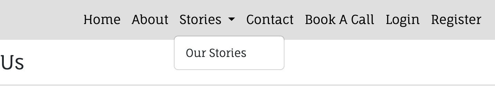
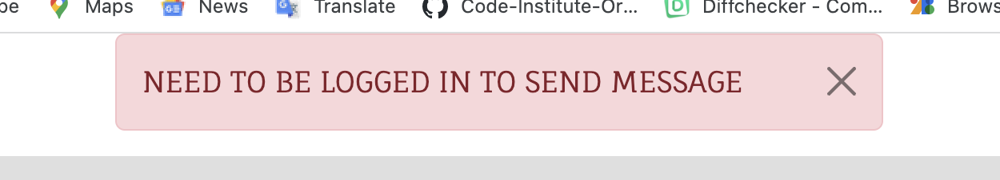
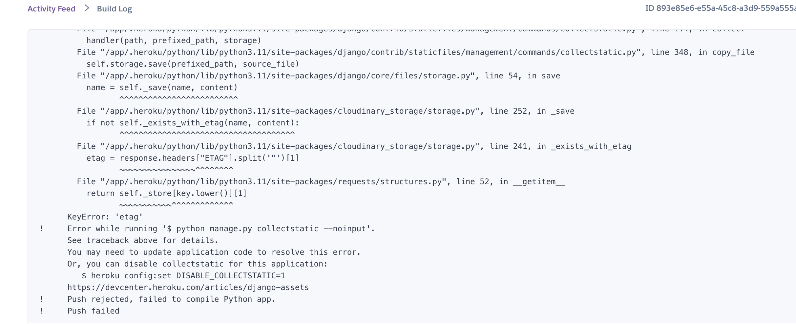

## Manual testing of user stories

1. As a Site User I want the navigation to be user-friendly so that I'm able to easily navigate through the app content.

| **Step**                            | **Expected Result**                       | **Actual Result** |
| ----------------------------------- | ----------------------------------------- | ----------------- |
| Open website                        | home page loads                           | Work as expected  |
| User scrolls through the home page  | Content of the page is presented          | Work as expected  |
| User click on a Link in the nav bar | User taken to desired part of the web app | Works as expected |

Screenshot

1. As a Site User I want to know info on what the app is about so that I can use its functionality for mutual benefit

| **Step**                                | **Expected Result**                     | **Actual Result** |
| --------------------------------------- | --------------------------------------- | ----------------- |
| Open website                            | home page loads                         | Work as expected  |
| User scrolls through the home page      | Website mission and vision is presented | Work as expected  |
| User click on about link in the nav bar | user taken to about page                | Works as expected |
| User scrolls through the about page     | About sections are presented            | Work as expected  |

 

Screenshot

1. As a Site User I can be able to register, login and logout from the website so that I can have a safe environment to work with

| **Step**                                         | **Expected Result**                  | **Actual Result** |
| ------------------------------------------------ | ------------------------------------ | ----------------- |
| User navigates to a "Register" link in a nav bar | Loads register form                  | Work as expected  |
| User fills the form correctly                    | Home page loads with success message | Work as expected  |
| User navigates to a "Login" link in a nav bar    | Loads Login form                     | Work as expected  |
| User fills the form correctly                    | Home page loads with success message | Work as expected  |
| User navigates to a "Logout" link in a nav bar   | Loads Logout confirm page            | Work as expected  |
| User click on logout button                      | Home page loads with success message | Work as expected  |

 

Screenshots

4. As a Site User I can be able to send message so that I can communicate with the website owner

| **Step**                                        | **Expected Result**                                      | **Actual Result** |
| ----------------------------------------------- | -------------------------------------------------------- | ----------------- |
| User navigates to a "Contact" link in a nav bar | Loads contact us form                                    | Work as expected  |
| User fills the form correctly                   | If user authorised: home page loads with success message | Work as expected  |
| User fills the form correctly                   | If user is not authorised: login page opens with message | Work as expected  |

 

Screenshots

5. As a Site User I can view the stories page so that I can view the stories

| **Step**                                        | **Expected Result**                       | **Actual Result** |
| ----------------------------------------------- | ----------------------------------------- | ----------------- |
| User navigates to a "Stories" link in a nav bar | The nav-bar expands to show "Our Stories" | Work as expected  |
| User navigates to a "Our Stories" link          | The "Our Stories" Page opens              | Work as expected  |

Screenshots

6. As a Site User I can click a story so that I can read the full post

| **Step**                                          | **Expected Result**                         | **Actual Result** |
| ------------------------------------------------- | ------------------------------------------- | ----------------- |
| User navigates to a "Stories" link in a nav bar   | The nav-bar expands to show "Our Stories"   | Work as expected  |
| User navigates to a "Our Stories" link            | The "Our Stories" Page opens                | Work as expected  |
| User clicks on "Read More" link in the story card | User is authorised: Story detail page opens | Work as expected  |
| User clicks on "Read More" link in the story card | User is unauthorised: Login page opens      | Work as expected  |

 

Screenshots

7. As a Site User I can comment on the story so that I can be involved in conversation

| **Step**                                          | **Expected Result**                                          | **Actual Result** |
| ------------------------------------------------- | ------------------------------------------------------------ | ----------------- |
| User navigates to a "Stories" link in a nav bar   | The nav-bar expands to show "Our Stories"                    | Work as expected  |
| User navigates to a "Our Stories" link            | The "Our Stories" Page opens                                 | Work as expected  |
| User clicks on "Read More" link in the story card | User is authorised: Story detail page opens                  | Work as expected  |
| User write a comment and submit                   | The comment is added in comment section with success message | Works as expected |

 

Screenshot

8. As a Site User I can delete comments so that I can delete unwanted comments in my story and also my comments in other's stories

| **Step**                                                 | **Expected Result**                          | **Actual Result**  |
| -------------------------------------------------------- | -------------------------------------------- | ------------------ |
| User navigates to a "Stories" link in a nav bar          | The nav-bar expands to show "Our Stories"    | Work as expected   |
| User navigates to a "Our Stories" link                   | The "Our Stories" Page opens                 | Work as expected   |
| User clicks on "Read More" link in the story card        | User is authorised: Story detail page opens  | Work as expected   |
| User clicks on delete icon next to their comment         | The comment is deleted with success message  | Work as expected   |
| Story creator clicks on Delete icon next to all comments |  The comment is deleted with success message |  Works as expected |

 

Screenshot

 

9. As a Site User I can add a story so that I can share my thoughts with different people

| **Step**                                                      | **Expected Result**                                     | **Actual Result** |
| ------------------------------------------------------------- | ------------------------------------------------------- | ----------------- |
| Navigate to "Add a story" link in the nav bar and click on it | The "Add Story" form is loaded                          | Work as expected  |
| Enter relevant data for posting the blog                      | Form is populated with user data                        | Work as expected  |
| Click the "Post" button                                       | user is redirected to stories page with success message | Work as expected  |

Screenshot

10. As a Site User I can edit my story so that I can change the content when I want

| **Step**                                          | **Expected Result**                                    | **Actual Result** |
| ------------------------------------------------- | ------------------------------------------------------ | ----------------- |
| User navigates to a "Stories" link in a nav bar   | The nav-bar expands to show "Our Stories"              | Work as expected  |
| User navigates to a "Our Stories" link            | The "Our Stories" Page opens                           | Work as expected  |
| User clicks on "Read More" link in the story card | User is authorised: Story detail page opens            | Work as expected  |
| Story creator clicks on "Edit" button             | The "Add Story" form is loaded with prepopulated value | Work as expected  |
| User edit the information and click on "Post"     | The "Our Stories" page opens with success message      | Work as expected  |

Screenshot

11. As a Site User I can be able delete my story so that I can delete my blog when needed

| **Step**                                          | **Expected Result**                               | **Actual Result** |
| ------------------------------------------------- | ------------------------------------------------- | ----------------- |
| User navigates to a "Stories" link in a nav bar   | The nav-bar expands to show "Our Stories"         | Work as expected  |
| User navigates to a "Our Stories" link            | The "Our Stories" Page opens                      | Work as expected  |
| User clicks on "Read More" link in the story card | User is authorised: Story detail page opens       | Work as expected  |
| Story creator clicks on "Delete" button           | The confirm delete page is loaded                 | Work as expected  |
| User clicks on "Cancel"                           | The story detail page opens                       | Work as expected  |
| User clicks on "Yes,Delete"                       | The "Our Stories" page opens with success message | Work as expected  |

Screenshot

12. As a Site User I can be able to add my profile to the website so that I can interact comfortably

| **Step**                                               | **Expected Result**                                                    | **Actual Result** |
| ------------------------------------------------------ | ---------------------------------------------------------------------- | ----------------- |
| User navigates to a "Register/login" link in a nav bar | Loads register/login form                                              | Work as expected  |
| User fills the form correctly                          | Home page loads with success message                                   | Work as expected  |
| User navigates to a "Profile" link in a nav bar        | The navbar expands and shows "Profile", "My bookings" and "My stories" | Work as expected  |
| User navigates to a "Profile"                          | The Profile page opens                                                 | Work as expected  |

Screenshot

  

13. As a Site User I can be able to edit and update my profile so that I can change details whenever I want

| **Step**                                               | **Expected Result**                                                    | **Actual Result** |
| ------------------------------------------------------ | ---------------------------------------------------------------------- | ----------------- |
| User navigates to a "Register/login" link in a nav bar | Loads register/login form                                              | Work as expected  |
| User fills the form correctly                          | Home page loads with success message                                   | Work as expected  |
| User navigates to a "Profile" link in a nav bar        | The navbar expands and shows "Profile", "My bookings" and "My stories" | Work as expected  |
| User navigates to a "Profile"                          | The Profile page opens                                                 | Work as expected  |
| User click on "update_profile" button                  |  Profile form page opens with prepopulated value                       |  Work as expected |
| User add details and click on "Update"                 | Profile page opens with success message                                | Work as expected  |

Screenshots

14. As a Site User I can be able to delete my profile so that I can be sure my data is save when I don't want to use website anymore

| **Step**                                               | **Expected Result**                                                               | **Actual Result** |
| ------------------------------------------------------ | --------------------------------------------------------------------------------- | ----------------- |
| User navigates to a "Register/login" link in a nav bar | Loads register/login form                                                         | Work as expected  |
| User fills the form correctly                          | Home page loads with success message                                              | Work as expected  |
| User navigates to a "Profile" link in a nav bar        | The navbar expands and shows "Profile", "My bookings" and "My stories"            | Work as expected  |
| User navigates to a "Profile"                          | The Profile page opens                                                            | Work as expected  |
| User click on "delete_profile" button                  |  Confirm delete page opens                                                        |  Work as expected |
| User clicks on "Cancel"                                | The profile page opens                                                            | Work as expected  |
| User clicks on "Yes, delete" button                    | Home page opens with success message and deleting user data including logging out | Work as expected  |

Screenshots

15. As a Site User I can book an appointment so that I can communicate with the site owner

| **Step**                                             | **Expected Result**                             | **Actual Result** |
| ---------------------------------------------------- | ----------------------------------------------- | ----------------- |
| User navigates to a "Book a call" link in a nav bar  | The Booking home page opens                     | Work as expected  |
| User clicks on "timeblock"                           | User is unauthorised: Login page opens          | Work as expected  |
| User clicks on "timeblock"                           | User is authorised: Add Booking form page opens | Work as expected  |
| User fills form correctly and click on "Book" button |  Booking home page opens with success message   | Work as expected  |

Screenshot

16. As a Site User I can view my bookings so that I can easily check for my bookings

| **Step**                                               | **Expected Result**                                                    | **Actual Result** |
| ------------------------------------------------------ | ---------------------------------------------------------------------- | ----------------- |
| User navigates to a "Register/login" link in a nav bar | Loads register/login form                                              | Work as expected  |
| User fills the form correctly                          | Home page loads with success message                                   | Work as expected  |
| User navigates to a "Profile" link in a nav bar        | The navbar expands and shows "Profile", "My bookings" and "My stories" | Work as expected  |
| User navigates to a "My Bookings"                      | The My bookings page opens                                             | Work as expected  |

Screenshot

17. As a Site User I can edit my appointment so that I can get flexibility in booking

| **Step**                                               | **Expected Result**                                                    | **Actual Result**  |
| ------------------------------------------------------ | ---------------------------------------------------------------------- | ------------------ |
| User navigates to a "Register/login" link in a nav bar | Loads register/login form                                              | Work as expected   |
| User fills the form correctly                          | Home page loads with success message                                   | Work as expected   |
| User navigates to a "Profile" link in a nav bar        | The navbar expands and shows "Profile", "My bookings" and "My stories" | Work as expected   |
| User navigates to a "My Bookings"                      | The My bookings page opens                                             | Work as expected   |
| User clicks on "edit icon" in booking table            | The add booking page opens                                             | Work as expected   |
| User choose another time and clicks on 'Book' button   | If booking available: Booking home page opens                          |  Works as expected |
| User choose another time and clicks on 'Book' button   | If booking unavailable: Form validation error displayes                |  Works as expected |

Screenshot

18. As a Site User I can delete my appointment so that I can have decide if I want to cancel the appointment

| **Step**                                               | **Expected Result**                                                    | **Actual Result** |
| ------------------------------------------------------ | ---------------------------------------------------------------------- | ----------------- |
| User navigates to a "Register/login" link in a nav bar | Loads register/login form                                              | Work as expected  |
| User fills the form correctly                          | Home page loads with success message                                   | Work as expected  |
| User navigates to a "Profile" link in a nav bar        | The navbar expands and shows "Profile", "My bookings" and "My stories" | Work as expected  |
| User navigates to a "My Bookings"                      | The My bookings page opens                                             | Work as expected  |
| User clicks on "delete icon" in booking table          | Confirm cancellation page opens                                        | Work as expected  |
| User clicks on "Go Back"                               | My bookings page opens                                                 | Work as expected  |
| User clicks on "Yes, Cancel" button                    | Booking home page opens with success message                           | Work as expected  |

Screenshot

19. As a Site Owner I want to restrict access to sections of an app to unauthenticated users so that basic standards of data protection are met

| **Step**                                                         | **Expected Result**                               | **Actual Result** |
| ---------------------------------------------------------------- | ------------------------------------------------- | ----------------- |
| Not logged in user: loads the page                               | Home page navbar without "Profile" nav-link opens | Work as expected  |
| Not logged in user: Clicks on "Stories" link                     | dropdown with only "Our Stories" is displayed     | Work as expected  |
| Not logged in User: clicks on "Read More" link in the story card | Login page opens                                  | Work as expected  |
| Not logged send message using contact form                       | Login page loads with warning message             | Work as expected  |
| Not logged in User: Clicks on "timeblock" in booking home page   | Login page opens                                  | Work as expected  |

 

Screenshot

20. As a Site Owner I would like that authenticated users have full access to web app and its functionality

| **Step**                                                     | **Expected Result**                                        | **Actual Result** |
| ------------------------------------------------------------ | ---------------------------------------------------------- | ----------------- |
| Logged in user: loads the page                               | Home page navbar with "Profile" nav-link opens             | Work as expected  |
| Logged in user: Clicks on any "Stories" link                 | dropdown with "Our Stories" and "Add a Story" is displayed | Work as expected  |
| Logged in User: Clicks on "Read More" link in the story card | Story detail page opens                                    | Work as expected  |
| Logged in send message using contact form                    | Home page with success message opens                       | Work as expected  |
| Logged in User: Clicks on "timeblock" in booking home page   | Add Booking form page opens                                | Work as expected  |

Screenshot

21. As a Site Owner I would like that each data entry is validated before stored in database

| **Step**                                                 | **Expected Result**                              | **Actual Result** |
| -------------------------------------------------------- | ------------------------------------------------ | ----------------- |
| Register form: Click register without all required fiels | Form error "Please fill in this field displayed" | Work as expected  |
| Login form: Click login without all required fiels       | Form error "Please fill in this field displayed" | Work as expected  |
| Contact form: Click send without all required fiels      | Form error "Please fill in this field displayed" | Work as expected  |
| Profile form: Click update without all required fiels    | Form error "Please fill in this field displayed" | Work as expected  |
| Add story form: Click Post without all required fiels    | Form error "Please fill in this field displayed" | Work as expected  |
| Booking form: Click book without all required fiels      | Form error "Please fill in this field displayed" | Work as expected  |

Screenshot

1.  As a Site Owner I would like that users can leave a message via contact form

| **Step**                                        | **Expected Result**                                      | **Actual Result** |
| ----------------------------------------------- | -------------------------------------------------------- | ----------------- |
| User navigates to a "Contact" link in a nav bar | Loads contact us form                                    | Work as expected  |
| User fills the form correctly                   | If user authorised: home page loads with success message | Work as expected  |
| User fills the form correctly                   | If user is not authorised: login page opens with message | Work as expected  |

Screenshot

23. As a Site Owner I would like that each authenticated user gets prompt messages when performing CRUD(Create,Read,Update,Delete) operations when using web app.

| **Step**                                                  | **Expected Result**                          | **Actual Result** |
| --------------------------------------------------------- | -------------------------------------------- | ----------------- |
| Profile update: User fills the data and clicks on update  | Profile page loads with success message      | Works as expected |
| Profile delete: User confirms delete                      | Home page loads with success message         | Works as expected |
| Story Add: User fills the data and clicks on Post         | Our stories page loads with success message  | Works as expected |
| Story update: User fills the data and clicks on Post      | Story detail page loads with success message | Works as expected |
| Story delete: User confirms delete                        | Our stories page loads with success message  | Works as expected |
| Booking Add: User fills the data and clicks on book       | Booking Home page loads with success message | Works as expected |
| Booking update: User fills the data and clicks on book    | Booking home page loads with success message | Works as expected |
| Booking cancel: User confirms cancel                      | Booking home page loads with success message | Works as expected |
| Comment Add : User fills the content and clicks on submit | Story detail page loads with success message | Works as expected |
| Comment delete: User clicks on delete icon                | Story page loads with success message        | Works as expected |

Screenshot

1.  As a Site Owner I would like that user can not book an appointment which is already booked

- NOTE: Timeblock is disabled in booking home page if booking exists

| **Step**                                                | **Expected Result**                                           | **Actual Result** |
| ------------------------------------------------------- | ------------------------------------------------------------- | ----------------- |
| User choose a timeblock in add bookinng form and submit | If booking already exists: Form validation error is displayed | Work as expected  |

Screenshot

## Bugs

### Dev Tool

- A type error was in all pages after loading the website
- The error is probably in Bootstrap itself

Screenshot

### Lighthouse

- The lighthouse was showing bad practice in all pages
- The following files were rendering the page:
  1. Google fonts
  2. Bootstrap min.js

Screenshot

### W3C Html Validator

- No bug was found during Html validation

### W3C CSS Validator

- No bug was found during CSS Validation

### CI Python Linter

- No bug was found during Python Validation

### Heroku Deployment

- Error was shown while deploying in Heroku.
- The same was resolved automatically after trying again
- Maybe the error was because of getting data from Database

Screenshot

## Unfixed Bugs

- No unfixed bugs from developer side
- Few bugs were unfixed which occurs because of external libraries: Google fonts and Bootstrap
